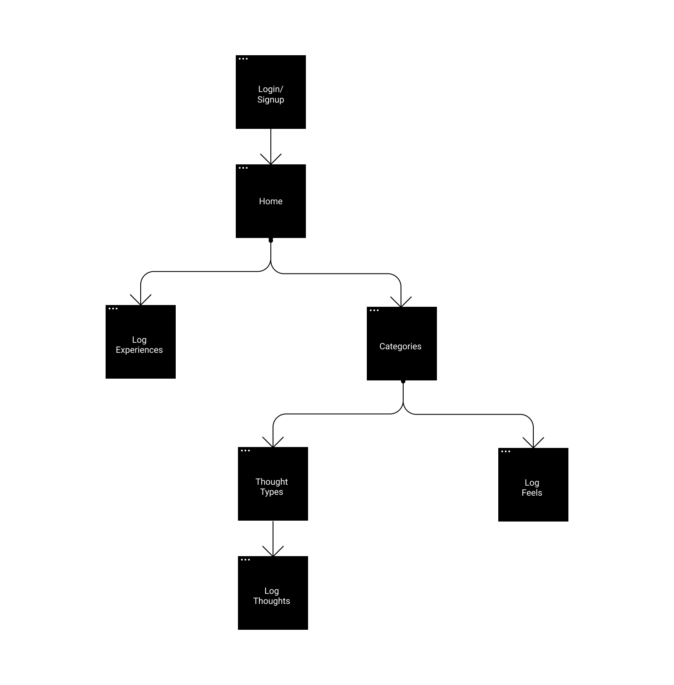

# knowThyself
An app to track what happened, what you're thinking and what you're feeling

## Version 1

### Core Functionality

1. User can record an experience
2. User can record a thought
3. User can record a feeling

Bonus functionality: https://github.com/tensorflow/tfjs-models/tree/master/universal-sentence-encoder
### Sitemap

The user experience will flow as follows:

### Components

The user flow drives the React components:

1. Login: Component which holds user authentication logic
    - Potential references:
        - https://css-tricks.com/firebase-react-part-2-user-authentication/
        - https://maksimivanov.com/posts/firebase-react-tutorial/
        - https://medium.com/firebase-developers/how-to-setup-firebase-authentication-with-react-in-5-minutes-maybe-10-bb8bb53e8834
        - https://medium.com/firebase-developers/how-to-setup-firebase-authentication-with-react-in-5-minutes-maybe-10-bb8bb53e8834
2. Home: Provides options to Log Experiences or Log Thoughts/Feels
3. Categories: User can select from a list of suggested and user-defined categories of thought
4. ThoughtTypes: User can select one of four options (Like, Don't Like, Want, Don't Want)
5. *Log Thoughts: User can input thought text
6. *Log Experiences: User can input experience type and description
7. *Log Feels: User can select and submit an emotion
8. Header: User can toggle between Thoughts and Feels
9. Footer: User can go back to previous page

*directly matches Core Functionality for Version 1
